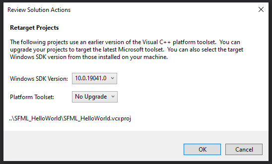

# Virus simulation

This project is made to simulate an epidemic in different environments with different user-defined parameters.
Made for hackPSU hackathon

## Build Instructions

Building should be straight-forward.

The first time you open the solution you should be presented with a dialog that
looks like the following:

Simply clone the repo, select a Windows 10 SDK and ensure that you do NOT
upgrade the platform toolset.

Current version of SFML being using in this project is for VS2017 so platform
toolset v141 needs to be installed before this project may run.
